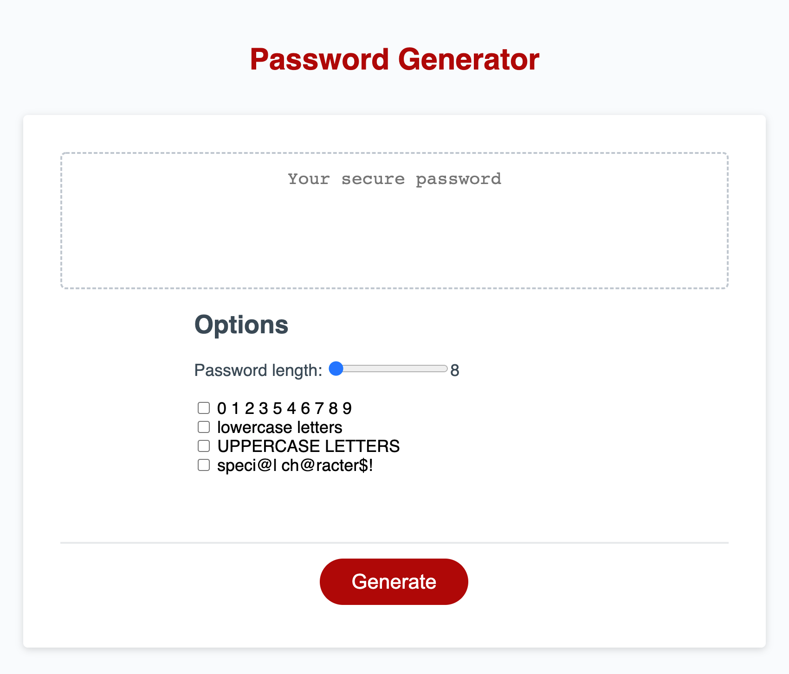

# 03-Challenge-PW-Generator
## About

The ESMT Boot Camp challenge is to create a random password generator using HTML, CSS, and Javascript based on user-selected criteria.  

The resulting user interface must be responsive, clean, and polished.  

## Screenshot

## Changelog

* Create core files and folder structure
* Copy starter code
* Create form fields
* Set query to set color for selection
* Capture and pass through password length 

## Challenges
* Changing style based on selector criteria
* Passing user selection from a range input to output using js textContent method and  oninput call in html
* Converting input object and converting it to a number using parseInt() 
* Scope of values (not just in functions)
* Targeting element for output with getElementById 
* Making it simpler by using querySelector

## Gratitude
* Xandromus via Github for project starter code
* Rahul R. via StackOverflow for answer to "HTML5 input type range show range value" (i.e., oninput)
* Programmer bud Morgan R. for helping me simplify my string selector and return value section
* Programmer bud Tiffany C. for stepping in when it all started looking like Greek to me
* MediaCollege.com for "How to Create Random Numbers & Characters"

## Contact
**Tammi L. Coles**  
Project link:  https://github.com/tlcoles/03-Challenge-PW-Generator  
Working copy:  https://tlcoles.github.io/03-Challenge-PW-Generator/  